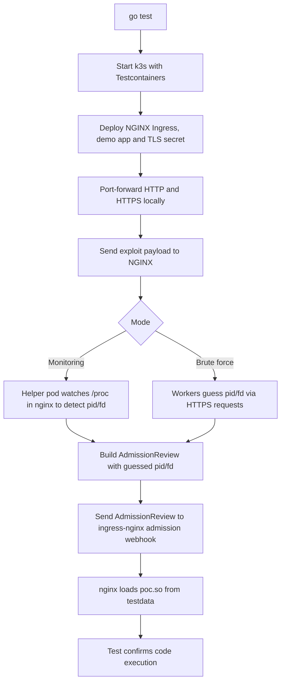

# Ingress Nightmare PoC

> Built on CVE-2025-1097 and CVE-2025-1974

Minimal PoC of the NGINX Ingress issue using Go tests and Testcontainers on top of k3s.



## Requirements

* Go
* Docker running (needed by Testcontainers)

## Monitoring mode (default)

```bash
go test -v -run TestPoC .
```

* Spins up k3s + NGINX Ingress.
* Uses an in-cluster helper to inspect `/proc` in the nginx pod and detect `pid/fd`.
* Builds and sends a single exploit AdmissionReview with the correct values.

Fast and reliable, but not a realistic attacker view (extra `/proc` visibility).

## Brute force mode

```bash
BRUTE_FORCE=true go test -v -run TestPoC .
```

Same scenario, but:

* Only interacts over HTTP/HTTPS.
* Brute-forces the `pid/fd` pair.
* Slower and **not fully tested**, so it may timeout or fail.
